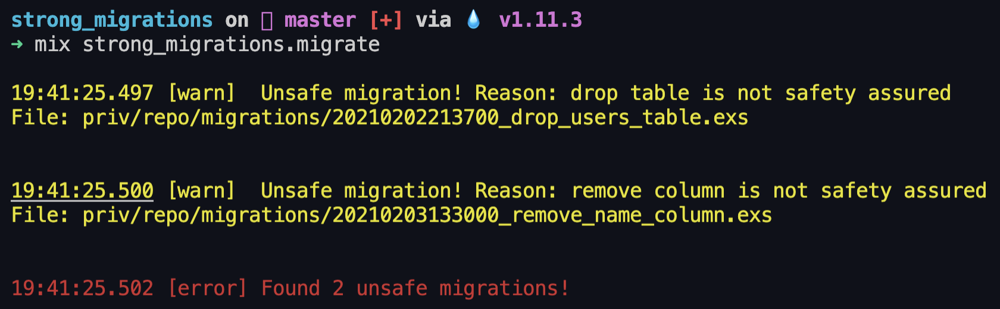

# StrongMigrations

[](https://github.com/surgeventures/strong_migrations/actions)
[](https://hex.pm/packages/strong_migrations)
[](https://hexdocs.pm/strong_migrations/)
[](https://hex.pm/packages/strong_migrations)
[](https://github.com/surgeventures/strong_migrations/blob/master/LICENSE.md)
[](https://github.com/surgeventures/strong_migrations/commits/master)

**Catch unsafe migrations in your Elixir application**

## Table of Contents

- [What is it?](#what-is-it)
- [How to install?](#how-to-install)
- [How to configure?](#how-to-configure)
- [Similar packages](#similar-packages)

## What is it

`strong_migrations` is a library that protects your application from invoking unsafe migrations, they needs to be marked as a safe.

1. Analyze migrations if they are safe.
2. If migrations are unsafe -> print errors.
3. If migrations are safe -> use `ecto.migrate`.

You can also use a macro of `StrongMigrations` like `safety_assured` to be sure it's safe and you can run migrations with specific changes. Example

```elixir
defmodule SafetyAssuredDropTable do
  @moduledoc false

  use StrongMigrations

  def change do
    safety_assured do
      drop(table(:users))
    end
  end
end
```



#### Features

- checking if your migrations are adding an index concurrently in transaction
- checking if your migrations are adding an index but not concurrently
- checking if your migrations are removing an index concurrently in transaction
- checking if your migrations are renaming columns (it's always better to remove old and add new column)
- checking if your migrations are removing columns
- checking if your migrations are removing tables
- mark `safety assured do: drop table(:posts)` or multiline when you're sure it's safe
- check if default is a function when altering a table
  ... tbd

## How to install

The package can be installed by adding `strong_migrations` to your list of dependencies in `mix.exs` as follows. Also, it's worth adding an alias like: `ecto.migrate -> strong_migrations.migrate` and thanks to that you'll be sure that all migrations were checked before running.

Update your `mix.exs`:

```elixir
def deps do
  [
    {:strong_migrations, "~> 0.1"}
  ]
end
```

Optionally, you can add an alias:

```elixir
"ecto.migrate": "strong_migrations.migrate"
```

And, another option is to use `StrongMigrations` as a default for generated migrations. Just add following line to your `config.exs` file.

```elixir
config :ecto_sql, migration_module: StrongMigrations
```

## How to configure

If you want to specify which classifiers you want to use, please add to your `config.exs` following lines

```elixir
config :strong_migrations,
  classifiers: [
    StrongMigrations.Classifiers.AddIndexConcurrentlyInTransaction,
    StrongMigrations.Classifiers.AddIndexNotConcurrently,
    StrongMigrations.Classifiers.DropIndexConcurrentlyInTransaction,
    StrongMigrations.Classifiers.DropTable,
    StrongMigrations.Classifiers.RemoveColumn,
    StrongMigrations.Classifiers.RenameColumn,
    StrongMigrations.Classifiers.DefaultIsFunction
  ]
```

If you want to specify migration paths available in your project (not default -> `priv/repo/migrations`), please add to your `config.exs` following lines

```elixir
config :strong_migrations,
  migration_paths: [
    "priv/repo/migrations",
    "apps/*/priv/repo/migrations",
    "my/fancy/path/to/migrations"
  ],
```

## Similar Packages

- https://github.com/ankane/strong_migrations (Ruby)
